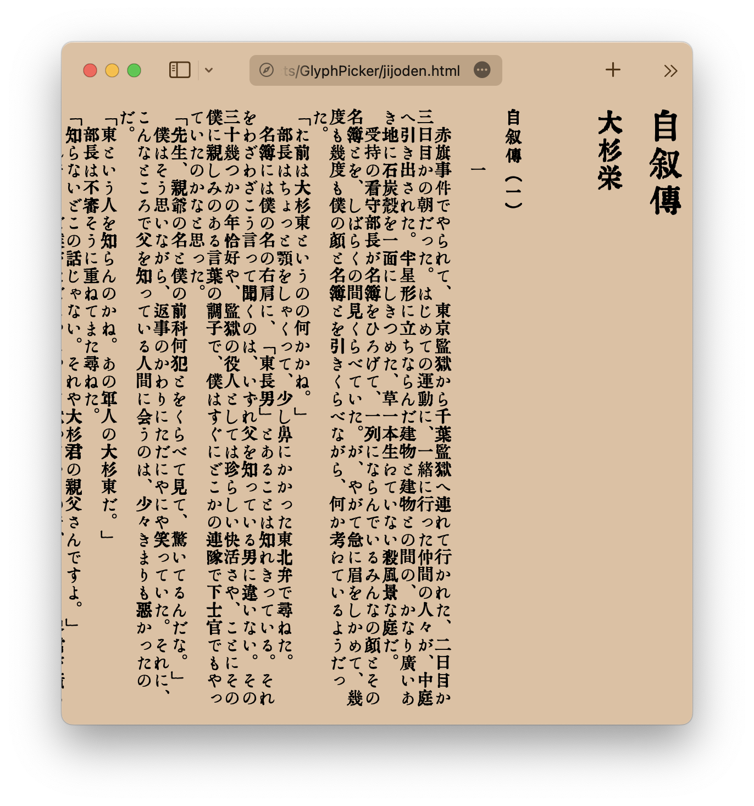

GlyphPicker: TTFから必要なグリフを抽出
===

GlyphPickerは、TrueTypeフォントから必要なグラフだけを抜き出してWOFF2フォーマットのWebFontを生成するツールです。コマンドラインから呼び出せる mkwf.py と、Webサーバーとして動作する FontServer.py、必要な関数群を持つGlyphPicker.pyから構成されています。

日本語は文字数が多いことから、フォントサイズが大きくなりがちで、なかなかWebfontで自由に様々な書体を組み合わせて使うことが難しかったのですが、実際に使われているグリフだけを抜き出すことで、様々な書体を組み合わせて使うことや、氏名の異体字など特殊な字形を表示することなどが容易になります。

動作環境
---

Python3.x fonttools Brotli Flask

Usage
---

README.mdに含まれる文字を抽出してWebFontを生成する例。

``` bash
python mkwf.py README.md
```

WebFontサーバーを立ち上げて動的にWebFontを生成する例。

``` bash
python FontServer.py
```

Webサーバーを立ち上げたら、ブラウザで [テストページ http://127.0.0.1:5000/test](http://127.0.0.1:5000/test) を開いてください。必要なグリフのみ抽出されたフォントを使ったテストページが表示されます。

利用例
---
[青空文庫 大杉榮『自叙伝』＋大正活字っぽい？フォントT5](jijoden.html)

