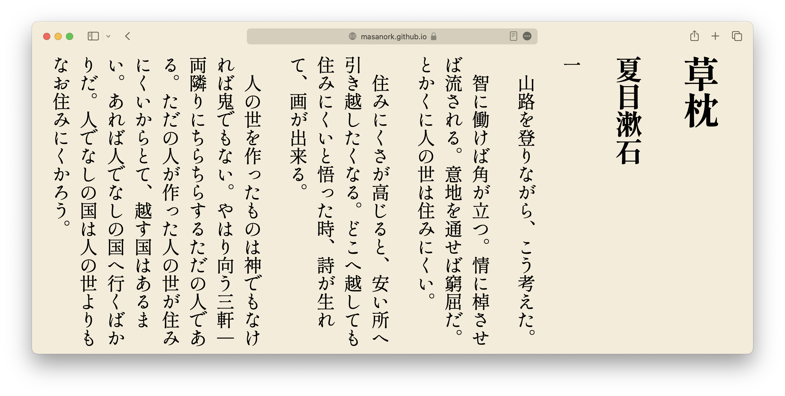

GlyphPicker: TTFからグリフを抽出してHTMLに埋込
===

GlyphPickerは、TrueTypeフォントから本文中に含まれる文字の表示に必要なグラフだけを抜き出してWebFontを生成し、Data URIとしてHTMLに埋め込むツールです。日本語は文字数が多いことから、フォントサイズが大きくなりがちで、テキストのまま様々な書体を組み合わせて使うことが難しかったのですが、実際に使われているグリフだけを抜き出してHTMLに埋め込むことで、多様な端末環境を対象に様々な書体を組み合わせたり、氏名の異体字など特殊な字形を表示することが容易になります。

利用例
---

[青空文庫 夏目漱石『草枕』＋しっぽり明朝 v3](776_ruby_6020.html)
しっぽり明朝 v3が10MBのところ、必要なグリフを抜き出したWebFontは1.2MB、当該WebFontをData URIとして埋め込んだHTMLは約2.1MBに。

[氏名異体字の書き分けと生成したWebFontのHTMLへのエンベッド](NameIVS.wfe.html)
TrueTypeフォント形式のIPAmj明朝が46.7MBのところ、当該WebFontを埋め込んだHTMLは122KBに。


動作環境
---

Python3.x bs4 fonttools Brotli Flask toml が必要です。

使い方

---
コマンドラインから呼び出して渡されたコンテンツに含まれる文字をWebFontとして切り出してHTMLに埋め込む mkwfe.py 、題名など個別の文字をWebFont Data URIとしてCSSに簡単に張り付けられるように出力する str2wfb64.py、WebFontサーバーとして動作する FontServer.py、青空文庫のzipファイルやテキストファイルをフォント埋込HTMLに変換する aoz2html.py 等から構成されています。

まず、ソースコードと同じディレクトリに利用したいフォントを配置し、font.tomlで参照するフォントを実際のパスに変更してください。例えば下の例では、標準フォントとしてNotoSans、BoldとSerifでは『草枕』のデモで利用している[しっぽり明朝](https://fontdasu.com/shippori-mincho/)を参照するように設定しています。

``` toml
[font]
directory = "fonts/"

# デフォルトのフォント設定
default = "NotoSansJP-VariableFont_wght.ttf"

# さまざまなスタイルのフォント設定
[font.styles]
bold = "ShipporiMincho-OTF-ExtraBold.otf"
serif = "ShipporiMincho-OTF-Regular.otf"
```

青空文庫のテキストファイルを整形するツールとして、aozip2txt.pyを用意しています。例えば夏目漱石の[草枕](https://www.aozora.gr.jp/cards/000148/files/776_ruby_6020.zip)を縦書きHTMLに整形する場合、以下のようにします。

``` bash
python aoz2html.py 776_ruby_6020.zip
# 776_ruby_6020.zipを展開して、776_ruby_6020.htmlを生成
```

以下にNameIVS.htmlに含まれる文字を抽出してWebFontを生成し、WebFontを埋め込んだ NameIVS.wfe.html を生成する例を示します。当該異体字セレクターに対応したグリフを持っているフォントでないと、正しく書き分けることができません。このデモでは[IPAmj明朝](https://moji.or.jp/mojikiban/font/)を利用しています。

``` bash
python mkwfe.py NameIVS.html
# NameIVS.html.woff2と、そのWebFontを参照するNameIVS.wf.html、
# WebFontを埋め込んだNameIVS.wfe.htmlを生成
```

WebFontサーバーを立ち上げて動的にWebFontを生成する例。

``` bash
python FontServer.py
```

Webサーバーを立ち上げたら、ブラウザで [テストページ http://127.0.0.1:5000/test](http://127.0.0.1:5000/test) を開いてください。必要なグリフのみ抽出されたフォントを使ったテストページが表示されます。

謝辞
---

デモにあたっては[青空文庫](https://www.aozora.gr.jp/)、 [しっぽり明朝](https://fontdasu.com/shippori-mincho/)、[IPAmj明朝](https://moji.or.jp/mojikiban/font/) を利用させていただきました。
aoz2html.pyの作成、『青空文庫』の外字や注釈を整形するに当たっては、[「青空文庫の外字をPythonでUnicodeに置換」](https://qiita.com/kichiki/items/bb65f7b57e09789a05ce)を参考にさせていただきました。
本プログラムの作成に当たっては、ChatGPT Code Interpreter、Github Copilotの出力を利用しています。
