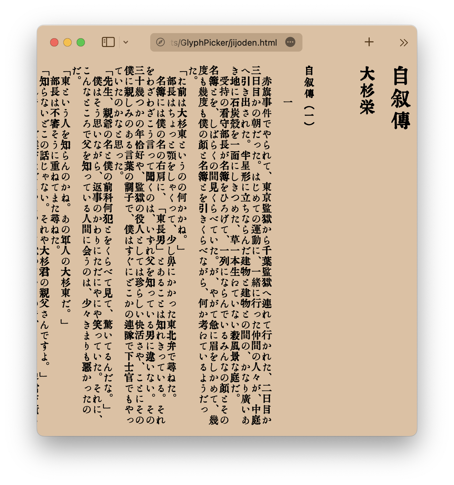
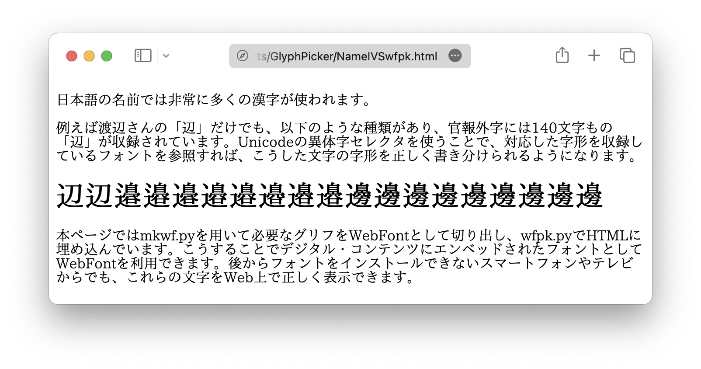

GlyphPicker: TTFから必要なグリフを抽出
===

GlyphPickerは、TrueTypeフォントから必要なグラフだけを抜き出してWOFF2フォーマットのWebFontを生成するツールです。コマンドラインから呼び出して渡されたコンテンツに含まれる文字をWebFontとして切り出す mkwf.py と、生成したWebFontをHTMLに埋め込む wfpk.py 、Webサーバーとして動作する FontServer.py 等から構成されます。

日本語は文字数が多いことから、フォントサイズが大きくなりがちで、なかなかWebfontで自由に様々な書体を組み合わせて使うことが難しかったのですが、実際に使われているグリフだけを抜き出すことで、様々な書体を組み合わせて使うことや、氏名の異体字など特殊な字形を表示することなどが容易になります。

利用例
---

[青空文庫 大杉榮『自叙伝』＋大正活字っぽい？フォントT5](jijoden.html)

[氏名異体字の書き分けと生成したWebFontのHTMLへのエンベッド](NameIVSwfpk.html)


動作環境
---

Python3.x bs4 fonttools Brotli Flask が必要です。

Usage
---

まず、ソースコードと同じディレクトリに利用したいフォントを配置し、GlyphPicker.pyで参照するフォントを実際のパスに変更してください。例えば下の例はNotoSansJPを参照するようになっています。

``` python
# GlyphPicker.py

from fontTools.ttLib import TTFont
from fontTools.subset import Subsetter, Options

# FONT_PATH = 'your_font_file_path.ttf'
FONT_PATH = 'NotoSansJP-VariableFont_wght.ttf'

def subset_font(text, output_file=None):
    font = TTFont(FONT_PATH)
```

NameIVS.htmlに含まれる文字を抽出してWebFontを生成して、WebFontを埋め込んだ NameIVSwfpk.html を生成する例。

``` bash
python mkwf.py NameIVS.html
# NameIVS.html.woff2と、そのWebFontを参照するNameIVS.wf.htmlを生成
python wfpk.py NameIVS.wf.html -o NameIVSwfpk.html
# WebFontを埋め込んだNameIVSwfpk.htmlを生成
```

WebFontサーバーを立ち上げて動的にWebFontを生成する例。

``` bash
python FontServer.py
```

Webサーバーを立ち上げたら、ブラウザで [テストページ http://127.0.0.1:5000/test](http://127.0.0.1:5000/test) を開いてください。必要なグリフのみ抽出されたフォントを使ったテストページが表示されます。
