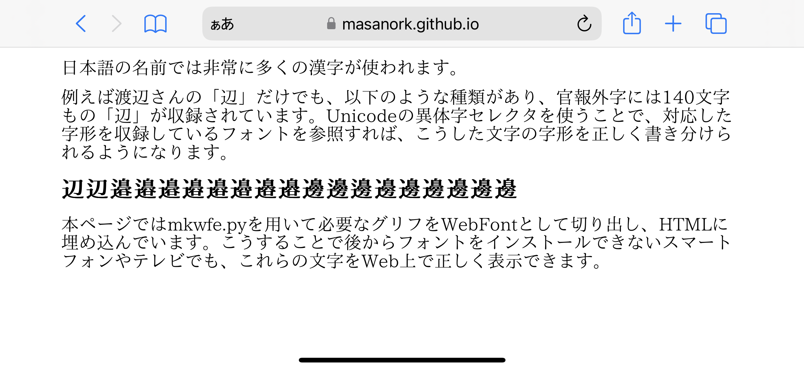

GlyphPicker: TTFから必要なグリフを抽出
===

GlyphPickerは、TrueTypeフォントから必要なグラフだけを抜き出してWOFF2フォーマットのWebFontを生成するツールです。コマンドラインから呼び出して渡されたコンテンツに含まれる文字をWebFontとして切り出す mkwf.py と、生成したWebFontをHTMLに埋め込む wfpk.py 、Webサーバーとして動作する FontServer.py 等から構成されます。

日本語は文字数が多いことから、フォントサイズが大きくなりがちで、なかなかWebfontで自由に様々な書体を組み合わせて使うことが難しかったのですが、実際に使われているグリフだけを抜き出すことで、様々な書体を組み合わせて使うことや、氏名の異体字など特殊な字形を表示することなどが容易になります。

利用例
---

[青空文庫 大杉榮『自叙伝』＋大正活字っぽい？フォントT5](jijoden.html)
大正活字っぽい？フォントT5が22.5MBのところ、必要なグリフを抜き出したWebFontは4.8MBに。

[青空文庫 夏目漱石『草枕』＋しっぽり明朝 v3](kusamakura.wfe.html)
しっぽり明朝 v3が10MBのところ、必要なグリフを抜き出したWebFontは1.2MB、当該WebFontを埋め込んだHTMLは約2MBに。


[氏名異体字の書き分けと生成したWebFontのHTMLへのエンベッド](NameIVSwfpk.html)
TrueTypeフォント形式のIPAmj明朝が46.7MBのところ、必要なグリフを抜き出したWebFontは93KB、当該WebFontを埋め込んだHTMLは126KBに。


動作環境
---

Python3.x bs4 fonttools Brotli Flask が必要です。

使い方
---

まず、ソースコードと同じディレクトリに利用したいフォントを配置し、GlyphPicker.pyで参照するフォントを実際のパスに変更してください。例えば下の例では、『草枕』のデモで利用している[しっぽり明朝](https://fontdasu.com/shippori-mincho/)を参照するように設定しています。

``` python
# GlyphPicker.py

from fontTools.ttLib import TTFont
from fontTools.subset import Subsetter, Options

# FONT_PATH = 'your_font_file_path.ttf'
FONT_PATH = 'ShipporiMincho-OTF-Medium.otf'

def subset_font(text, output_file=None):
    font = TTFont(FONT_PATH)
```

以下にNameIVS.htmlに含まれる文字を抽出してWebFontを生成し、WebFontを埋め込んだ NameIVS.wfe.html を生成する例を示します。

``` bash
python mkwfpk.py NameIVS.html
# NameIVS.html.woff2と、そのWebFontを参照するNameIVS.wf.html、
# WebFontを埋め込んだNameIVS.wfe.htmlを生成
```

青空文庫のテキストファイルを整形するツールとして、aozip2txt.pyを用意しています。例えば夏目漱石の[草枕](https://www.aozora.gr.jp/cards/000148/files/776_ruby_6020.zip)を縦書きHTMLに整形する場合、以下のようにします。

``` bash
python aozip2txt.py 776_ruby_6020.zip
# 776_ruby_6020.zipを展開して、kusamakura.txtを生成
python mkwfpk.py kusamakura.txt -v
# kusamakura.txt.woff2と、参照するkusamakura.wf.html、
# WebFontを埋め込んだkusamakura.wfe.htmlを生成
# -vオプションを付与することで縦書きHTMLを生成
```

WebFontサーバーを立ち上げて動的にWebFontを生成する例。

``` bash
python FontServer.py
```

Webサーバーを立ち上げたら、ブラウザで [テストページ http://127.0.0.1:5000/test](http://127.0.0.1:5000/test) を開いてください。必要なグリフのみ抽出されたフォントを使ったテストページが表示されます。
